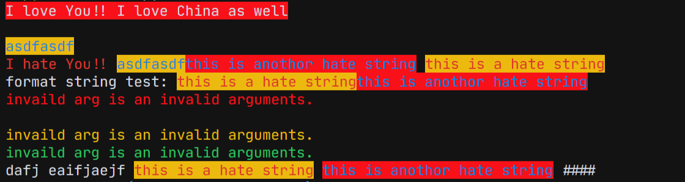

# Colorprt

It's a simple package for you to customize the printing color.

pypi: <https://pypi.org/project/colorprt/>

## ScreenShots



## New Features

We add some default color config in out package.

```python
from colorprt.default import warn_color, success_color, error_color

warn_color.print("Print a warn message")
success_color.print("Print a success message")
error_color.print("Print an error message")
```

We found that some people use this package on linux server, so that there is no auto completions. It will trouble users.
Therefore, we add a feature that
You don't need to type: `mode=`; `foreground=`; `background=`

just call functions or class like this:

In old versions:

```python
from colorprt import colorprt, Back, Fore

# CAUTION: Do not use this after version: 3.0.0
colorprt("Hello World", backgound=Back.RED)
```

Use new features:

```python
from colorprt import colorprt, Back, Fore

colorprt("Hello World", Back.RED, Fore.YELLOW)
```

## Usage

### Get Started

```bash
pip install colorprt
```

```bash
python test/test.py
```

### Detailed Documentation

function colorprt will automatically call output function: `print`

```python
from colorprt import colorprt, Back, Fore

colorprt("Hello World", Back.RED)
```

- Back stands for background;
- Fore stands for foreground;
- Mode stands for printing mode. ( font style like: underline, bold, flash, reverse )

Also, you can use `ColorprtConfig` class to set colored strings.

```python
from colorprt import ColorprtConfig, Mode, Back, Fore

pycolor_config = ColorprtConfig(Mode.BOLD, Back.DEFAULT, Fore.RED)

# You can use ColorprtConfig to set a color string configuration

colored_formatted_str = pycolor_config("I love You!!")

print(colored_formatted_str)

# or just use print method

pycolor_config.print("I love you!!", end="x10086\n")
```

If you just want the ansi colored formatted strings, you can use `colorstr` class.

```python
from colorprt import colorstr, Mode, Back, Fore, ColorprtConfig

hate_print_config = ColorprtConfig(Mode.UNDER_LINE, Back.DEFAULT, Fore.YELLOW)
print(colorstr("I love You!!", Mode.BOLD, Back.DEFAULT, Fore.RED)
      + colorstr("I hate you", hate_print_config))
```

if you use str() to force change to string. You will get

```
>>> str(colorstr("I love You!!", Mode.BOLD, Back.DEFAULT, Fore.RED)
      + colorstr("I hate you", hate_print_config))
>>> '\x1b[0m\x1b[1;31mI love You!!\x1b[0m\x1b[4;33mI hate you\x1b[0m\x1b[0m'
```


```python
from colorprt import colorstr, Mode, Back, Fore, ColorprtConfig

hate_print_config = ColorprtConfig(Mode.UNDER_LINE, Back.DEFAULT, Fore.YELLOW)

output = str(colorstr('I hate You', hate_print_config))
```


